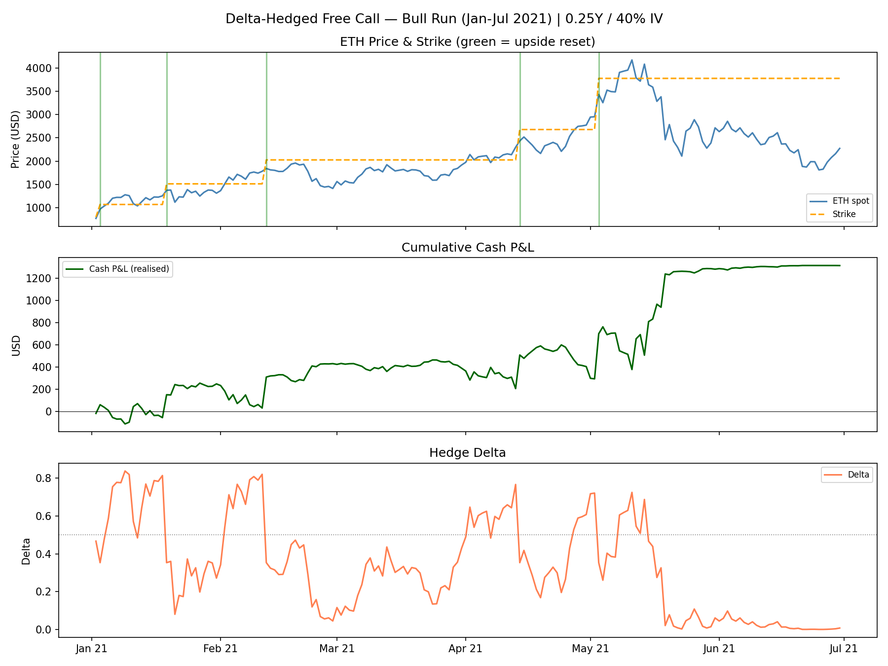
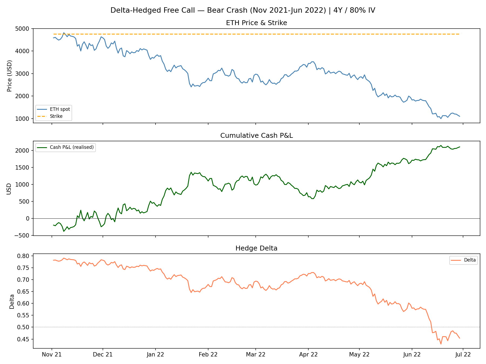
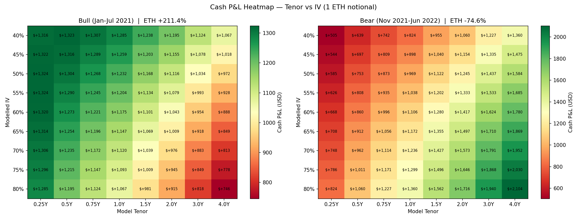

# Delta-Hedged Free Call Option Strategy

## Overview

We receive a free 4-year American call option on ETH, 10% out-of-the-money at issuance. Rather than holding it passively, we delta hedge it using short perpetual futures — capturing the gamma P&L over time while remaining approximately directionally neutral. The option is modelled as a 1-year / 60 IV European call for the purpose of computing the hedge delta.

---

## Mechanics

### Position at inception
- Receive call: strike = spot × 1.10
- Compute BS delta using T=1Y, σ=60%
- Open short perp position = delta × notional

### Daily management
1. Pay / receive funding on short perp position
2. Recompute delta at new spot
3. Rebalance perp to new delta — book realised P&L on move

### Reset trigger
When spot reaches 20% ITM (S/K ≥ 1.20), intraday:
- Exercise call — capture intrinsic = (S − K) × notional
- Issue new call: strike = spot × 1.10
- Recompute delta and rebalance perp

### P&L components
| Component | Description |
|---|---|
| Perp P&L | Realised gains/losses from daily hedge rebalancing |
| Intrinsic | Cash captured at each upside reset |
| Funding | Paid or received on short perp position |
| Option mark | Unrealised BS value of current call (not counted in cash P&L) |

> **Note:** Cash P&L (perp + intrinsic ± funding) is the honest performance metric. Option mark depends entirely on model assumptions and is excluded from comparisons.

---

## Why It Works

For every $1 ETH moves up:
- The call gains $1 of intrinsic (once ITM)
- The short perp loses $delta < $1

Since delta is always less than 1 (option starts 10% OTM, delta ~0.5), intrinsic accumulates faster than the hedge bleeds. This is the P&L of being **long gamma** — large directional moves always net positive. In a bear market the same logic applies in reverse: the short perp profits on every dollar down, partially offset by the shrinking position as delta falls toward zero.

---

## Backtests

### Bull Run — Jan–Jul 2021 (ETH +211%)

| Metric | Value |
|---|---|
| Cash P&L | **+$1,175 (+161%)** |
| Perp P&L | -$789 |
| Intrinsic captured | +$1,965 (5 resets) |
| Funding paid | -$53 |
| Option mark (unrealised) | +$190 |

5 resets fired in 6 months. Intrinsic was the dominant profit driver — each reset captured 20%+ of the prevailing spot price. The perp hedge bled against the rally but was substantially outweighed by intrinsic at each reset.

---

### Bear Crash — Nov 2021–Jun 2022 (ETH −75%)

| Metric | Value |
|---|---|
| Cash P&L | **+$1,106 (+26%)** |
| Perp P&L | +$1,106 |
| Intrinsic captured | $0 (0 resets) |
| Funding paid | -$73 |
| Option mark (unrealised) | +$3 |

No resets fired. Profit came entirely from the short perp position gaining on the -75% move. Note that gains are asymptotic — delta shrinks as ETH falls, so the position size contracts and you earn less per dollar of additional downside. Most of the perp gain was captured in the first 40% leg down.

---

## Parameter Sensitivity

The two key model inputs — tenor and IV — both control the same thing: **delta sizing**. Higher tenor or higher IV → higher delta → larger short perp position.

### The core tension

| Regime | Optimal tenor | Optimal IV | Reason |
|---|---|---|---|
| Bull | Short (0.25Y) | Low (40%) | Small short → less bleed against rally |
| Bear | Long (4Y) | High (80%) | Large short → more profit on the way down |

These are exact opposites. No single fixed parameter set dominates both regimes.

### Tenor sweep (σ=60% fixed, cash P&L)

| Tenor | Bull Cash P&L | Bear Cash P&L |
|---|---|---|
| 0.25Y | **+$1,320** | +$668 |
| 1.00Y | +$1,175 | +$1,106 |
| 4.00Y | +$888 | **+$1,780** |

1Y is a reasonable all-weather compromise — within ~15% of optimal in the bull, within ~40% of optimal in the bear.

### IV sweep (T=1Y fixed, cash P&L)

| IV | Bull Cash P&L | Bear Cash P&L |
|---|---|---|
| 40% | **+$1,285** | +$824 |
| 60% | +$1,175 | +$1,106 |
| 80% | +$1,067 | **+$1,360** |

Same pattern. Lower IV wins in bull, higher IV wins in bear.

### 2D Heatmap (tenor × IV, cash P&L)

The heatmap confirms the diagonal structure: top-left (low tenor, low IV) is optimal in bull, bottom-right (high tenor, high IV) optimal in bear. The current default of 1Y/60IV sits near the centre of both grids.

---

## Stress Testing

### Worst-case scenario: slow grind up, reset never fires

**Price path:** ETH grinds from $2,000 toward $2,629 (just below 20% ITM reset level) over 45 days, pulls back to $2,100, repeats 4 cycles. Total drift: +5% over 8 months. Reset never fires (or barely fires once at the margin).

**Why this is the worst case:**
- Perp bleeds continuously on the upward drift
- No intrinsic captured (no reset)
- Funding drag accumulates throughout

**Key finding:** On Hyperliquid, shorts receive funding (negative funding rate) rather than paying it. This converts the only structural risk into a tailwind.

| Component | Value |
|---|---|
| Perp P&L | +$350 (fixed by price path) |
| Funding received (10% rate) | +$87 |
| **Cash P&L** | **+$437** |

**Funding income sensitivity:**

| Funding Rate | Cash P&L | Funding Income |
|---|---|---|
| 10% | +$437 | +$87 |
| 30% | +$610 | +$260 |
| 50% | +$783 | +$433 |
| 100% | +$1,216 | +$866 |

The strategy is profitable on this worst-case path at any funding rate when shorts receive. The higher the funding rate, the better the outcome.

---

## Other Stress Scenarios (Conceptual)

| Scenario | Outcome | Reason |
|---|---|---|
| Flash crash then recovery | Flat to small gain | Perp gains on crash, gives back on recovery; reset fires on bounce if big enough |
| Prolonged bear (full year, -80%) | Good profit early, flatlines | Delta shrinks as spot falls — diminishing returns below -40% |
| Choppy sideways | Positive | High realised vol = gamma scalp wins; this is actually the ideal environment |
| Slow grind up, high funding (paying) | Potentially negative | The only true kill scenario — mitigated on Hyperliquid by negative funding |

---

## Summary

| | Bull +211% | Bear -75% | Stress (grind) |
|---|---|---|---|
| Cash P&L | **+$1,175** | **+$1,106** | **+$437** |
| Return on notional | +161% | +26% | +22% |
| Primary driver | Intrinsic at resets | Short perp gains | Perp + funding income |
| Risk | Perp bleed on rally | Diminishing returns | Mitigated by Hyperliquid funding |

The strategy is profitable across all tested regimes. The structural edge is the free option — it costs nothing to hold, it resets on every 20% rally capturing intrinsic, and the short perp hedge profits in bear markets. On Hyperliquid, negative funding converts the worst-case scenario from a drag into additional income.

**Default parameters: T=1Y, σ=60% — a reasonable all-weather setting.**
